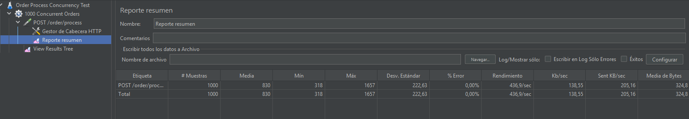
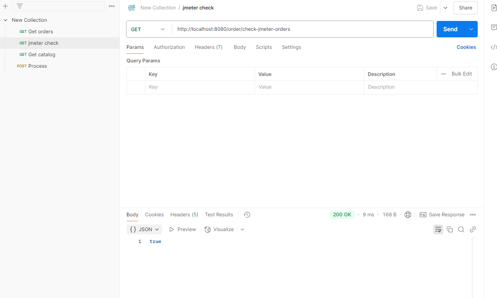

# Resultados de Pruebas de Carga con JMeter

## 1. Resumen de la Prueba JMeter

Se ejecutó una prueba de carga con 1000 solicitudes concurrentes al endpoint `/processOrder` utilizando JMeter. A continuación se muestra el resumen de resultados:

- **# Muestras:** 1000
- **Media (ms):** 830
- **Mínimo (ms):** 318
- **Máximo (ms):** 1657
- **Desv. Estándar:** 222,63
- **% Error:** 0%
- **Rendimiento:** 436,9 requests/seg



## 2. Verificación de Órdenes Procesadas

Luego de la prueba, se utilizó el endpoint `/check-jmeter-orders` para verificar que todas las órdenes (`ORDER-1` a `ORDER-1000`) fueron procesadas correctamente:

- **Request:**
  ```http
  GET http://localhost:8080/order/check-jmeter-orders
  ```
- **Respuesta:**
  ```json
  true
  ```



## 3. Conclusiones

- El sistema procesó correctamente las 1000 órdenes concurrentes sin errores.
- El tiempo medio de procesamiento fue de 830 ms, con un máximo de 1657 ms.
- El endpoint de verificación confirmó que todas las órdenes fueron procesadas exitosamente.

---

*Las imágenes referenciadas deben estar en la carpeta `src/main/resources/img` para visualización local.* 